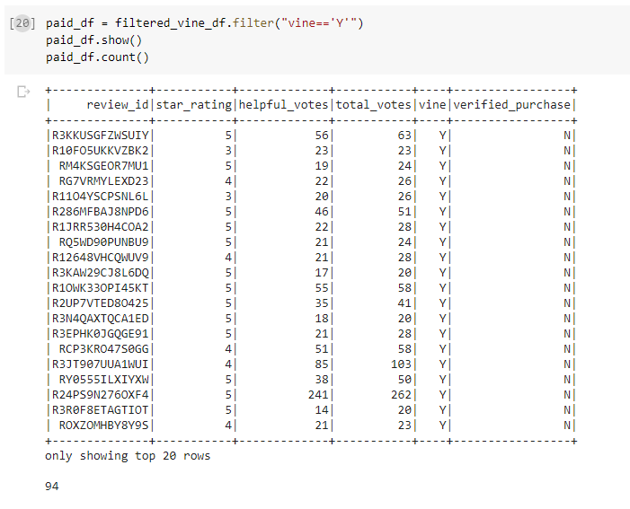
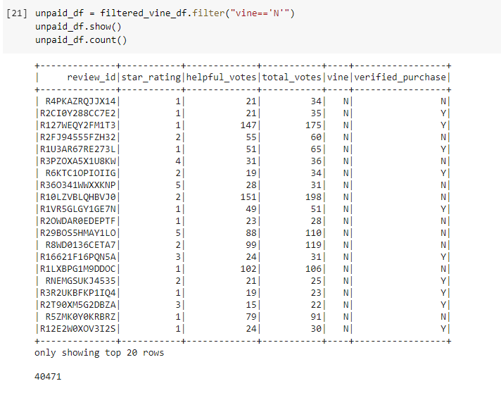
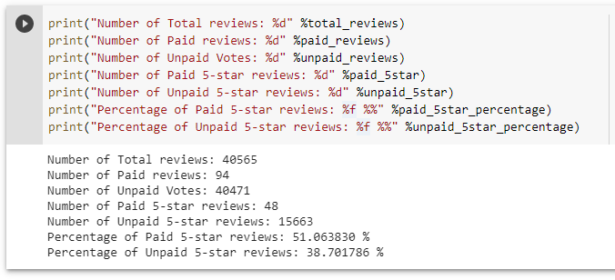

# Amazon_Vine_Analysis :video_game:	:joystick:	

## Overview

BigMarket, a company that helps businesses optimize their marketing strategy, has hired me as a consulting data expert. One of the clients of BigMarket, SellBy, has requested some analytics on thier products. The project involves analyzing Amazon reviews written by members of the paid Amazon vine program. The Amazon vine program is a service that allows manufacturers and publishers to receive reviews for their products. Using PySpark, ETL is performed to extract the Video Games dataset from the raw data dump, transform the data, connect and load the data to an AWS RDS instance. Further PySpark analysis has been used to compare paid vine reviews with unpaid product reviews and check for any positivity bias in the vine reviews.

## Results
Before analyzing the data, we filtered down the total vine reviews dataset to contain reviews that met both the following conditions:
* Reviews which had greater than or equal to 20 total votes
* Reviews with atleast a 50% ratio of helpful votes to total votes

* There were 94 Vine reviews in the dataset and they were a small subset of the entire video_game review dataset

* There were 40471 unpaid reviews

* There were 48 5-:star:	 vine reviews
* There were 15663 non-vine 5-:star:	 reviews
* 51% of vine reviews were 5-:star:	 reviews
* 38% of non-vine reviews were 5-:star:	 reviews 
